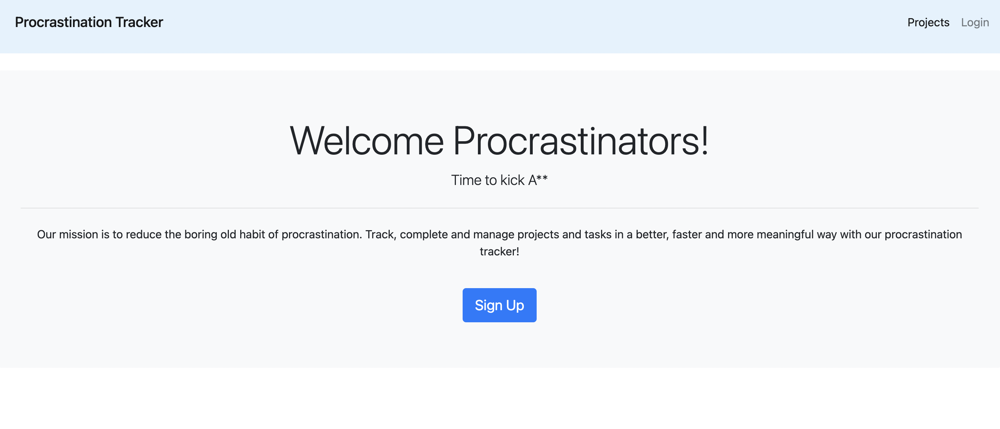
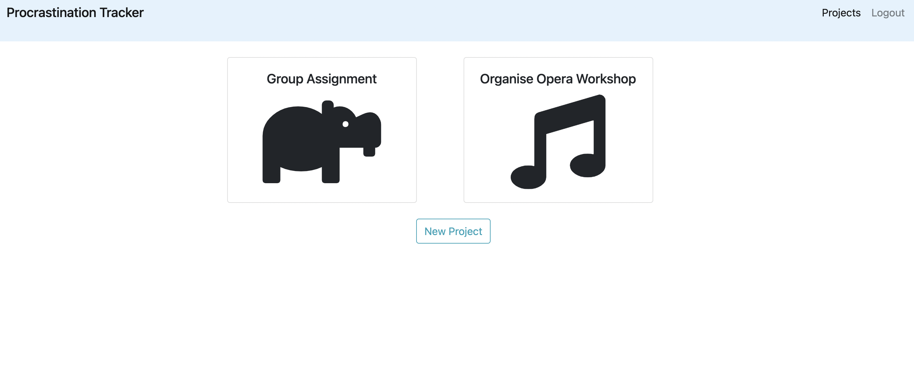
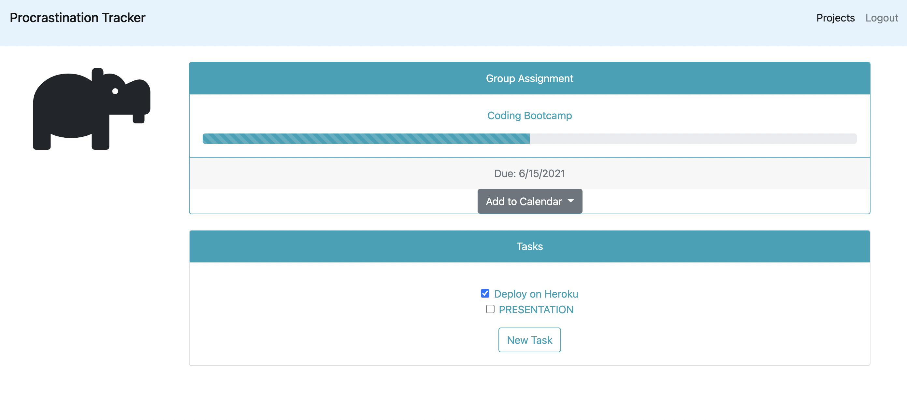

# **Procrastination Tracker** :chart_with_upwards_trend:

The Procratination Tracker is a web based application designed to help keep track of tasks no matter how big or small, while minimising procrastination which often arises when faced with daunting tasks. Here, tasks can be broken down into tracked tasks keeping the user engaged and focused on the project.

### **Features**

- User sign up, login and sign out functions
- Save and view tasks and task components
- Set due date for project
- Assign any number of "To be complete" components to any project
- Dynamic progress bar according to how many tasks are complete within the project
- Add to calender function via Google, iCal, Outlook or Yahoo!

### **Useage**

Deployed at : https://procrastination-tracker.herokuapp.com/

### **Technologies**

- HTML
- CSS
- BootStrap
- Node js
- Express js
- Express Handlebars package
- Add2Calender package
- Sequalize package

### **Future Development**

Web browser and email notifications.

Adding user SMS functionality for reminders and prompts. Feedback from SMS prompts to enable automatic updating of user components and tasks on the fly.

Ranking reward system where each user can see their individual rank grade according to the number of components and tasks complete over time. Users must be completing projects and tasks in order to maintain or increase level

### **Contributing**
Created by Madeleine O'Dea, Sona Shrestha, Joshua Rhymer Bernardo and Richard Hopkins

### **Links**

[GitHub Repository](https://github.com/madsterest/procrastination-tracker)

For more examples of my work, please visit my GitHub at [madsterest](https://github.com/madsterest) or contact me at odea.madeleine@gmail.com

